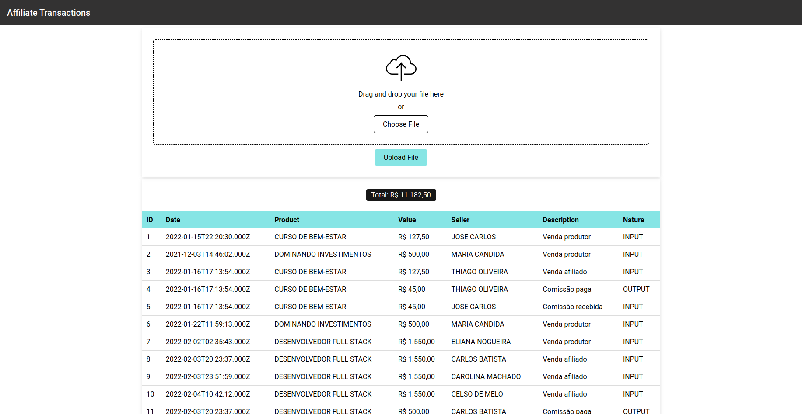

# Fullstack Afiliados



- Apresentação

>  [Home | Loom - 25 July 2023 - Watch Video](https://www.loom.com/share/cdcf9f395dcf4b1ab9fe2874919632d8?sid=c7eb22fe-f810-4c44-a925-caa50071241e)

Esta é a minha solução para o Desafio Fullstack Afiliados, um projeto full-stack que envolve a construção de uma interface web para fazer o upload de um arquivo de transações de produtos vendidos, normalizar os dados e armazená-los em um banco de dados relacional. O objetivo deste desafio é demonstrar minhas habilidades de desenvolvimento full-stack e minha capacidade de trabalhar com as tecnologias sugeridas.

<br>

## Tecnologias Utilizadas
---

- Frontend: React.js
- Backend: Node.js com Express.js
- Banco de Dados: MySQL
- Outras bibliotecas: Prisma, Multer, Styled Components, React Toastify, Mock Service Worker

<br>

## Processo de Criação do Projeto
---

Durante o processo de criação do projeto, foram seguidos alguns passos para atender aos principais objetivos e necessidades propostos no desafio. A história a seguir relata o desenvolvimento do projeto, desde o entendimento inicial até o fim do projeto.

- Leitura e Entendimento do Projeto:
Após receber o desafio Fullstack Afiliados, foi realizada uma leitura minuciosa dos requisitos apresentados. Isso incluiu a compreensão das funcionalidades esperadas, como a criação da interface web para fazer o upload de um arquivo de transações de produtos vendidos, a normalização dos dados e o armazenamento em um banco de dados relacional. Essa etapa foi essencial para definir a direção do desenvolvimento.

- Aprendizado das Tecnologias Propostas:
O desafio propôs a utilização das seguintes tecnologias: React.js para o frontend, Node.js com Express.js para o backend e MySQL para o banco de dados. Foi necessário dedicar um tempo ao aprendizado dessas tecnologias. Foram estudados tutoriais, documentações e exemplos de código para adquirir o conhecimento necessário para implementá-las adequadamente no projeto.

- Criação do MVP:
Inicialmente, foi criado um MVP (Minimum Viable Product) sem a execução das requisições necessárias para consumir o arquivo de transações. Nessa fase, foram desenvolvidos os componentes básicos da aplicação frontend, como a interface de usuário para fazer o upload do arquivo, e o backend com endpoints iniciais para receber o arquivo e normalizar os dados. Também foi criada a estrutura de arquivos e a configuração inicial do projeto.

- Consumo do Arquivo de Transações e Compreensão dos Requisitos:
Após a criação do MVP, foi implementada a funcionalidade de consumo do arquivo de transações no backend, seguindo as definições de interpretação do arquivo. Foi necessário compreender a estrutura das transações e normalizar os dados para armazená-los adequadamente no banco de dados relacional.

- Revisão dos Componentes e Funcionalidades:
Com a funcionalidade básica implementada, foi realizada uma revisão dos componentes desenvolvidos. Foram feitas melhorias no código, ajustes de estilo e refatorações para garantir a qualidade e a usabilidade da aplicação frontend. Além disso, o backend foi revisado para garantir o correto armazenamento dos dados normalizados no banco de dados.

- Criação de Testes:
Para garantir a qualidade e a estabilidade do código, foram desenvolvidos testes automatizados tanto no frontend quanto no backend. Foram utilizadas as bibliotecas de testes Jest e React Testing Library para o frontend e Vitest e Supertest para o backend.

- Containerização com Docker:
Visando facilitar o processo de implantação e garantir a portabilidade do projeto, foi realizada a containerização com o Docker. Foi criado um Dockerfile para cada serviço (frontend, backend e banco de dados) que define as dependências, comandos de construção e configurações necessárias para executar a aplicação em um ambiente Docker.

- Criação do Docker Compose
Para facilitar o deploy e colaboração com a equipe de desenvolvimento e operações (DevOps), foi implementado o Docker Compose para orquestrar os serviços do projeto Fullstack Afiliados. O Docker Compose é uma ferramenta que permite definir e executar aplicativos multi-contêiner de forma simples e rápida.

<br>

## Descrição do Projeto
---

O projeto Fullstack Afiliados tem como objetivo criar uma plataforma exclusiva para o upload de um arquivo contendo transações de produtos vendidos por nossos clientes. A plataforma opera no modelo criador-afiliado, permitindo que um criador venda seus produtos e tenha múltiplos afiliados também realizando vendas desses produtos. Em troca das vendas, é paga uma comissão.

A aplicação será composta por uma interface web que possibilita o upload do arquivo de transações, a normalização dos dados e o armazenamento em um banco de dados relacional. Para atender aos requisitos do desafio, a aplicação fornecerá as seguintes funcionalidades:

- Tela de upload de arquivo: Através de um formulário, o usuário poderá fazer o upload do arquivo contendo as transações de produtos vendidos.
- Normalização dos dados: Após o upload, a aplicação deverá fazer o parsing do arquivo recebido, normalizando os dados para garantir a consistência das informações.
- Armazenamento no banco de dados: Os dados normalizados das transações devem ser armazenados em um banco de dados relacional.
- Exibição da lista de transações: A aplicação deve ser capaz de exibir a lista de transações de produtos importadas, agrupadas por produtor/afiliado, mostrando também o totalizador do valor das transações realizadas.
- Tratamento de erros: O backend deve ter tratamentos de erro adequados, fornecendo mensagens de erro amigáveis no frontend para uma melhor experiência do usuário.

<br>

## Como Começar
---

## Para executar o projeto siga estas etapas:

Para facilitar o deploy e colaboração com a equipe de DevOps, o projeto foi configurado para funcionar com Docker Compose. Siga estas etapas para executar o projeto usando o Docker Compose:

1. Certifique-se de ter o Docker Compose instalado em sua máquina.
2. Clone o repositório: `git clone https://github.com/mateussousaa/fullstack-afiliados.git`
3. Navegue até o diretório do projeto: `cd fullstack-afiliados`
4. Renomeie o `.env.example` para `.env`
5. Execute o comando `docker-compose up -d --build`
6. Execute o comando `docker exec -it affiliates_backend npm run init`
7. O projeto estará sendo executado em `http://localhost:5173`

<br>

## Formato dos Arquivos
---

- Existe um arquivo chamado sales.txt com o formato correto na raíz do projeto

| Campo    | Início | Fim | Tamanho | Descrição                      |
| -------- | ------ | --- | ------- | ------------------------------ |
| Tipo     | 1      | 1   | 1       | Tipo da transação              |
| Data     | 2      | 26  | 25      | Data - ISO Date + GMT          |
| Produto  | 27     | 56  | 30      | Descrição do produto           |
| Valor    | 57     | 66  | 10      | Valor da transação em centavos |
| Vendedor | 67     | 86  | 20      | Nome do vendedor               |

<br>

## Documentação da API
---

<details>

<summary><strong>:brazil: Versão em português</strong></summary>

## Transações

### Insere as transações

- Requisição (content-type: multipart/form-data)

```http
  POST /upload
```

- Resposta

```
{
  "message": "Transactions were inserted"
}
```

### Lista as transações


```http
  GET /
```

- Resposta

```

"message": [
  {
    "id": 1,
    "date": "2022-01-15T22:20:30.000Z",
    "product": "CURSO DE BEM-ESTAR",
    "value": 12750,
    "seller": "JOSE CARLOS",
    "typeId": 1,
    "type": {
	  "id": 1,
	  "description": "Venda produtor",
	  "nature": "INPUT",
	  "signal": "POSITIVE"
    }
  },
  {
    "id": 2,
    "date": "2021-12-03T14:46:02.000Z",
    "product": "DOMINANDO INVESTIMENTOS",
    "value": 50000,
    "seller": "MARIA CANDIDA",
    "typeId": 1,
    "type": {
	  "id": 1,
	  "description": "Venda produtor",
	  "nature": "INPUT",
	  "signal": "POSITIVE"
    }
  }
]
```

</br>

</details>

<details>

<summary><strong>:us: English version</strong></summary>

## Transactions

### Insert Transactions

- Request (content-type: multipart/form-data)

```http
  POST /upload
```

- Response

```
{
  "message": "Transactions were inserted"
}
```

### List Transactions


```http
  GET /
```

- Response

```

"message": [
  {
    "id": 1,
    "date": "2022-01-15T22:20:30.000Z",
    "product": "CURSO DE BEM-ESTAR",
    "value": 12750,
    "seller": "JOSE CARLOS",
    "typeId": 1,
    "type": {
	  "id": 1,
	  "description": "Venda produtor",
	  "nature": "INPUT",
	  "signal": "POSITIVE"
    }
  },
  {
    "id": 2,
    "date": "2021-12-03T14:46:02.000Z",
    "product": "DOMINANDO INVESTIMENTOS",
    "value": 50000,
    "seller": "MARIA CANDIDA",
    "typeId": 1,
    "type": {
	  "id": 1,
	  "description": "Venda produtor",
	  "nature": "INPUT",
	  "signal": "POSITIVE"
    }
  }
]
```

</br>

</details>

</br>

## Testes Unitários
---

Para garantir a qualidade e confiabilidade do código, foram implementados testes unitários. As seguintes bibliotecas e frameworks foram utilizados para os testes:

- Testes Unitários: Vitest, React Testing Library, Jest e Mock Service Worker.

Para executar os testes, utilize os seguintes comandos:

- Entre nos diretórios `backend` ou `frontend`

- Executar testes unitários: `npm run test`

<br>

>  This is a challenge by [Coodesh](https://coodesh.com/)
